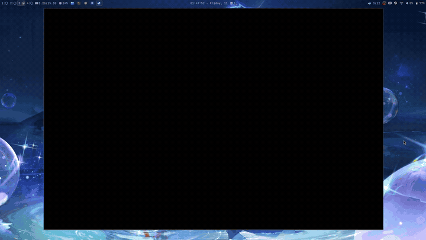

# Steam Desktop Startup Movies

Millennium plugin that plays a startup movie on Steam launch, like Steam Deck.

## Demo



## Install

Requires [Millennium](https://steambrew.app) v3.4.1+.

**Linux**

```bash
curl -fsSL https://raw.githubusercontent.com/tuan-cre/steam-desktop-startup-movies/master/install.sh | bash
```

**Windows** (PowerShell, run as admin)

```powershell
irm https://raw.githubusercontent.com/tuan-cre/steam-desktop-startup-movies/master/install.ps1 | iex
```

> Both installers clone the plugin, use the shipped prebuilt frontend
> (no build needed), and enable it when Steam is closed.
> Windows needs no python; ffmpeg is optional everywhere (thumbnails only).

## Movies

Drop video files into the plugin's `movies/` folder, then restart Steam.

- Linux: `~/.local/share/millennium/plugins/startup-movies/movies/`
- Windows: `C:\Program Files (x86)\Steam\millennium\plugins\startup-movies\movies\`

Or: Steam → Millennium → Plugins → ▾ → Browse local files.

Ships with `Hades.webm`. Supported: `.webm` `.mp4` `.m4v` `.mov` `.mkv` `.ogv` `.ogg` — whatever Chromium decodes. Unplayable files are skipped.

## Config

Steam → Millennium → Plugins → **Startup Movies**: toggle on, then ▾ → Configure.

Pick movie, fit, transition, shuffle, audio. Preview plays immediately.

Set Startup Location to **Library** (Interface settings), otherwise the Store covers the movie.

At launch the movie plays fullscreen — click or let it end for your Library.

## Tips

- Turn off "Notify me about additions or changes to my games" (Interface settings) so the news popup doesn't cover the movie.
- A few seconds of black screen before the movie is normal Steam boot.

## Troubleshoot

- Plugin grayed out / no panel → fully quit Steam and relaunch (plugins load at startup only)
- Store page covers the movie → set Startup Location to **Library** (Interface settings)
- No movies → check `movies/`, hit Refresh
- No thumbnail → install ffmpeg
- No sound → enable Audio

## License

MIT — see [LICENSE](LICENSE).
